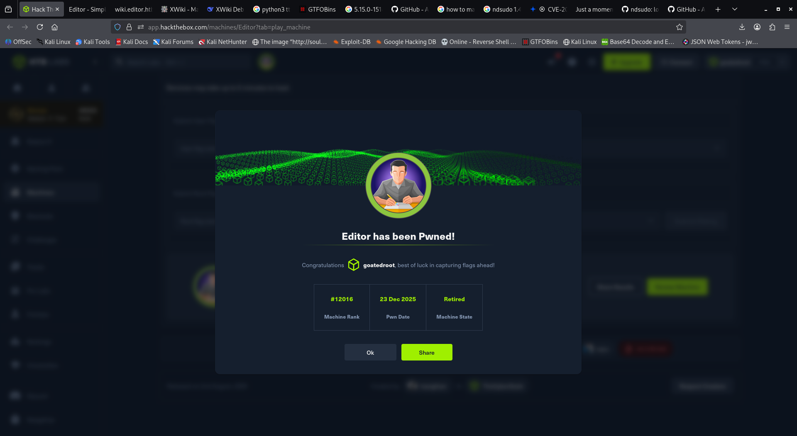

# Editor — HackTheBox

**Category:** Web / Linux  
**Difficulty:** Easy  

---

## nmap

```
80/tcp   open  http    nginx 1.18.0 (Ubuntu)
8080/tcp open  http    Jetty 10.0.20
22/tcp   open  ssh     OpenSSH 8.9p1 Ubuntu 3ubuntu0.13 (Ubuntu Linux; protocol 2.0)
```

---

## enumeration

subdomain bruteforce result:

```
wiki                    [Status: 302, Size: 0, Words: 1, Lines: 1, Duration: 258ms]
```

running XWiki Debian 15.10.8 — vulnerable to CVE-2025-24893 (RCE)

---

## foothold

exploited CVE-2025-24893 and got shell

in `/etc/xwiki/hibernate.cfg.xml` we found DB creds:

```
Database: xwiki
Username: xwiki
Password: theEd1t0rTeam99
Host: localhost
```

in `/etc/passwd` we saw user oliver and the db password worked on him too:

```bash
ssh oliver@10.10.11.x
```

---

## privilege escalation

doing `id` we saw we are part of group `999(netdata)`

```bash
find / -group 'netdata' 2>/dev/null
find / -perm -4000 2>/dev/null
```

found many executables with suid in `/opt/netdata/usr/libexec/netdata/plugins.d` — one which was most interesting was `ndsudo` as it had sudo in its name lol

what we found:

```
ndsudo is a SUID binary (rwsr-x---)
when you run it, it executes with root privileges
its designed to run specific commands like nvme-list, megacli-disk-info, etc.
when we run ./ndsudo nvme-list, it:
  - checks what binary to run (in this case, nvme)
  - searches for nvme in the system PATH
  - executes nvme list --output-format=json as root
```

but the problem which was occurring is that it was making the rootbash but it was my user (oliver) owned so it didnt make any difference

so after a while of looking around I checked the version of netdata:

```bash
/opt/netdata/bin/netdata -v
```

it was a vulnerable version (CVE-2024-32019), so using a public exploit I got root!

---

## proof


